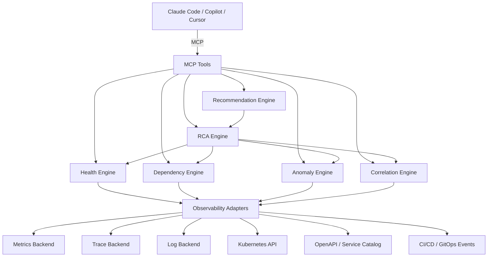
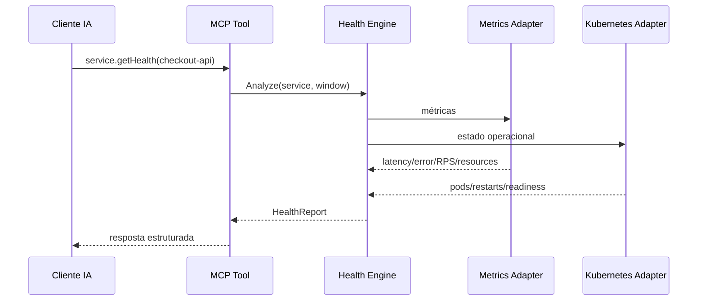
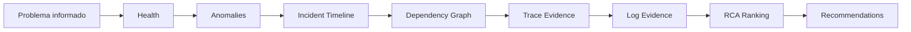
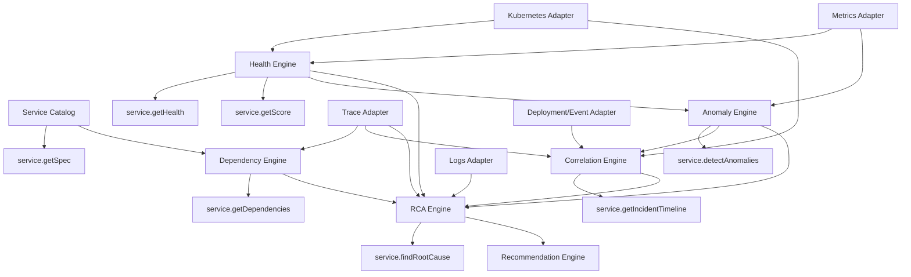
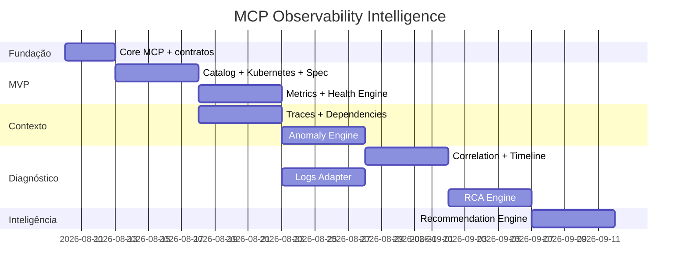

# Especificação de Implementação — MCP Observability Intelligence para AKS

**Status:** Proposta de arquitetura  
**Objetivo:** permitir que clientes de IA como Claude Code, GitHub Copilot CLI, Cursor ou outros clientes MCP entendam, consultem e expliquem o estado de aplicações em um cluster AKS usando métricas, traces, logs, dados do Kubernetes e especificações das aplicações.

---

## 1. Visão executiva

O sistema será um **MCP Server especializado em observabilidade e diagnóstico de aplicações**, atuando como uma camada de inteligência entre clientes de IA e as fontes reais de observabilidade do cluster.

O MCP não deve apenas fornecer dados brutos. Seu principal valor é transformar sinais de telemetria em respostas estruturadas como:

- estado atual de uma aplicação;
- degradação de response time;
- aumento anormal de volume;
- crescimento de erros;
- saturação de CPU ou memória;
- reinícios, OOMKilled e falhas de readiness/liveness;
- dependências entre serviços;
- impacto em cascata;
- timeline de um incidente;
- provável causa raiz;
- recomendações de investigação ou mitigação;
- score de saúde da aplicação.

A arquitetura será organizada em três camadas principais:

1. **Coleta e adaptação de dados**
2. **Inteligência e correlação**
3. **Ferramentas MCP expostas aos agentes de IA**

A prioridade de implementação será gerar valor visível cedo. Por isso, os primeiros componentes serão os mais independentes: catálogo de aplicações, adapters, `service.getSpec`, `service.getHealth` e `service.getDependencies`. Anomaly Detection, correlação e RCA serão adicionados posteriormente sobre essa base.

---

## 2. Objetivos

### 2.1 Objetivo principal

Permitir que um agente de IA responda perguntas como:

> Por que o checkout está lento?

> O response time desta aplicação piorou nas últimas duas horas?

> Houve aumento anormal de tráfego?

> Quais aplicações serão impactadas se `produto-api` estiver degradada?

> O erro começou depois de algum deploy?

> Qual é a causa mais provável do incidente atual?

> Quais aplicações do namespace estão degradadas agora?

### 2.2 Objetivos técnicos

- abstrair as diferentes fontes de observabilidade;
- fornecer contratos estáveis para clientes MCP;
- reduzir envio de grandes volumes de telemetria ao LLM;
- executar agregações e análises no servidor MCP;
- produzir evidências explicáveis;
- correlacionar métricas, traces, logs e eventos de Kubernetes;
- permitir substituição futura dos backends de observabilidade;
- operar com permissões somente leitura;
- oferecer respostas rápidas para diagnóstico operacional.

### 2.3 Não objetivos iniciais

Na primeira versão, o MCP não deverá:

- executar rollback automaticamente;
- alterar HPA;
- escalar deployments;
- reiniciar pods;
- alterar ConfigMaps ou Secrets;
- executar queries arbitrárias fornecidas pelo LLM sem controle;
- funcionar como substituto de Prometheus, Jaeger, Tempo, Loki ou outro backend;
- depender de Machine Learning complexo para gerar valor.

A primeira versão deve ser **read-only e evidence-driven**.

---

# 3. Princípio central da arquitetura

O cliente de IA não deve receber milhares de logs, traces ou séries temporais e tentar interpretar tudo diretamente.

O fluxo recomendado é:



O MCP transforma:

```text
telemetria bruta
      ↓
dados normalizados
      ↓
indicadores
      ↓
anomalias
      ↓
correlações
      ↓
evidências
      ↓
diagnóstico
      ↓
explicação para a IA
```

---

# 4. Observação sobre OpenTelemetry

OpenTelemetry deve ser tratado como a **camada padrão de instrumentação, geração e transporte da telemetria**.

Normalmente o MCP não consulta o OpenTelemetry Collector para realizar análises históricas. Ele consulta os backends onde os sinais foram armazenados.

Exemplos:

| Sinal | Instrumentação | Backend consultável |
|---|---|---|
| Métricas | OpenTelemetry Metrics | Prometheus, Mimir, Dynatrace, Azure Monitor etc. |
| Traces | OpenTelemetry Traces | Jaeger, Tempo, Dynatrace etc. |
| Logs | OpenTelemetry Logs | Loki, Elasticsearch, Dynatrace etc. |
| Infraestrutura | Kubernetes | Kubernetes API / kube-state-metrics / metrics backend |

Por isso a arquitetura deverá usar **interfaces/adapters**.

Exemplo conceitual:

```csharp
public interface IMetricsProvider { }
public interface ITraceProvider { }
public interface ILogProvider { }
public interface IKubernetesProvider { }
public interface IApplicationSpecProvider { }
public interface IDeploymentEventProvider { }
```

Os módulos de inteligência dependem dessas interfaces, e não diretamente de Prometheus, Jaeger ou Loki.

---

# 5. Camada 1 — Coleta e Adapters

## 5.1 Service Catalog

### Responsabilidade

Manter uma representação normalizada das aplicações conhecidas pelo MCP.

### Informações mínimas

- nome lógico;
- namespace;
- Deployment;
- Service Kubernetes;
- labels;
- versão;
- imagem;
- réplicas;
- endpoints conhecidos;
- OpenAPI;
- `service.name` do OpenTelemetry;
- identificador usado no backend de traces;
- identificador usado no backend de métricas;
- time responsável, quando disponível.

### Exemplo

```json
{
  "service": "checkout-api",
  "namespace": "ecommerce",
  "deployment": "checkout-api",
  "otelServiceName": "checkout-api",
  "version": "1.12.4",
  "replicas": 6,
  "openApi": true
}
```

### Dependências

- Kubernetes API;
- labels/annotations;
- OpenAPI das aplicações;
- opcionalmente GitOps ou catálogo corporativo.

### Importância

**Crítica.**

Sem um catálogo normalizado, os demais módulos terão dificuldade para relacionar:

```text
Deployment
↕
Service Kubernetes
↕
otel.service.name
↕
nome do serviço no Jaeger
↕
labels do Prometheus
↕
OpenAPI
```

Essa normalização deve ser implementada cedo.

---

## 5.2 Metrics Adapter

### Responsabilidade

Consultar métricas sem expor detalhes do backend para os módulos superiores.

### Operações recomendadas

```text
getRequestRate()
getErrorRate()
getLatencyPercentiles()
getCpuUsage()
getMemoryUsage()
getPodRestarts()
getSaturation()
getAvailability()
queryRange()
```

### Saída normalizada

```json
{
  "metric": "http.server.duration.p95",
  "service": "checkout-api",
  "window": "15m",
  "value": 0.820,
  "unit": "seconds"
}
```

### Dependências

Backend de métricas.

### Importância

**Crítica.**

É a principal fonte para avaliação objetiva de saúde e tendências.

---

## 5.3 Trace Adapter

### Responsabilidade

Consultar traces recentes e transformar spans em informações úteis para análise.

### Operações

```text
getSlowTraces()
getErrorTraces()
getServiceDependencies()
getTrace()
getSpanLatencyByDependency()
```

### Informações importantes

- serviço;
- operação;
- duração;
- status;
- parent span;
- child spans;
- downstream service;
- atributos HTTP;
- exceções;
- trace ID.

### Importância

**Alta.**

Permite responder não apenas que uma aplicação está lenta, mas **onde a latência está sendo gasta**.

---

## 5.4 Logs Adapter

### Responsabilidade

Buscar logs relevantes relacionados a um serviço, trace ou período.

### Operações

```text
searchErrors()
searchByTraceId()
searchByPod()
searchAroundTimestamp()
getErrorPatterns()
```

### Regra importante

O módulo não deve retornar milhares de linhas ao cliente.

Deve:

1. filtrar;
2. agrupar;
3. remover duplicações;
4. identificar padrões;
5. retornar amostras representativas.

### Importância

**Alta para RCA**, mas não é pré-requisito para o primeiro MVP.

---

## 5.5 Kubernetes Adapter

### Responsabilidade

Consultar o estado operacional real do cluster.

### Dados

- Pods;
- Deployments;
- ReplicaSets;
- Services;
- HPA;
- Nodes;
- Events;
- readiness;
- liveness;
- restarts;
- OOMKilled;
- Pending;
- CrashLoopBackOff;
- resource requests/limits.

### Importância

**Crítica.**

Telemetria pode mostrar sintomas; Kubernetes frequentemente mostra a condição operacional que explica o sintoma.

---

## 5.6 Application Specification Adapter

### Responsabilidade

Obter a especificação funcional/técnica da aplicação.

### Fontes possíveis

- OpenAPI;
- annotations;
- ConfigMaps específicos;
- catálogo corporativo;
- metadados do deployment.

### Informações

- rotas;
- métodos;
- contratos;
- dependências declaradas;
- versão;
- descrição.

### Importância

**Alta.**

É o componente que permite à IA compreender o que a aplicação deveria fazer, além do que ela está fazendo agora.

---

## 5.7 Deployment/Event Adapter

### Responsabilidade

Capturar eventos que podem explicar alterações comportamentais.

### Fontes

- Kubernetes Events;
- Argo CD;
- GitHub Actions;
- Azure DevOps;
- Git;
- sistema interno de deploy.

### Eventos

```text
deploy
rollback
scale
config change
image change
HPA action
pod restart
node replacement
```

### Importância

**Muito alta para correlação e RCA**, mas pode ser implementado depois do MVP básico.

---

# 6. Camada 2 — Módulos de Inteligência

# 6.1 Health Engine

## Objetivo

Responder:

> Esta aplicação está saudável?

O Health Engine transforma diversas métricas em um estado operacional compreensível.

### Entradas

- request rate;
- error rate;
- P50;
- P95;
- P99;
- disponibilidade;
- CPU;
- memória;
- restarts;
- saturação;
- readiness;
- estado dos pods.

### Saída

```json
{
  "service": "checkout-api",
  "status": "degraded",
  "score": 71,
  "findings": [
    {
      "type": "latency",
      "severity": "warning",
      "message": "P95 aumentou 82% em relação ao baseline"
    }
  ]
}
```

### Score

Sugestão inicial:

```text
100 pontos
  |
  ├─ disponibilidade
  ├─ error rate
  ├─ latência
  ├─ saturação
  └─ estabilidade de pods
```

O score deve combinar:

- SLO/threshold conhecido;
- baseline histórico;
- impacto;
- severidade.

### Importância

**Crítica e primeira inteligência a ser implementada.**

É independente dos módulos mais complexos e gera resultado visível rapidamente.

---

# 6.2 Dependency Engine

Embora possa ser considerado parte do catálogo, é recomendável tratá-lo como uma capacidade própria.

## Objetivo

Construir e consultar o grafo:

```text
frontend
   ↓
checkout-api
   ├── payment-api
   ├── product-api
   └── redis
```

### Fontes

1. traces;
2. service map do backend de tracing;
3. OpenAPI/configuração;
4. catálogo.

### Saída

```json
{
  "service": "checkout-api",
  "outbound": [
    "payment-api",
    "product-api"
  ],
  "inbound": [
    "bff-commerce"
  ]
}
```

### Funções adicionais

- blast radius;
- upstream dependencies;
- downstream dependencies;
- critical dependency path.

### Importância

**Crítica para RCA e análise de impacto.**

Pode gerar valor cedo e não depende do Anomaly Engine.

---

# 6.3 Anomaly Engine

## Objetivo

Identificar mudança de comportamento, não apenas violação de threshold.

Exemplo:

```text
P95 normal: 180–230 ms
P95 atual: 470 ms

Threshold fixo: 500 ms → aparentemente OK
Baseline: +110% → anomalia
```

### Anomalias principais

#### Latência

- crescimento de P95;
- crescimento de P99;
- regressão repentina;
- degradação progressiva.

#### Tráfego

- aumento súbito de RPS;
- queda súbita;
- volume incompatível com padrão histórico.

#### Erros

- crescimento de 5xx;
- crescimento de timeout;
- 429;
- retries;
- circuit breaker.

#### Recursos

- CPU anormal;
- memory growth;
- restart rate;
- OOMKilled.

### Estratégia de implementação

Começar simples:

1. comparação entre janelas;
2. média móvel;
3. EWMA;
4. robust Z-score.

Somente posteriormente considerar:

- Isolation Forest;
- modelos sazonais;
- ML.

### Exemplo

```json
{
  "type": "traffic_spike",
  "service": "checkout-api",
  "expectedRps": 820,
  "currentRps": 2450,
  "deviation": 1.98,
  "severity": "critical"
}
```

### Dependências

- Metrics Adapter;
- Health Engine;
- armazenamento de baselines.

### Importância

**Muito alta.**

É o módulo que transforma monitoramento reativo em observabilidade inteligente.

---

# 6.4 Baseline Store

## Objetivo

Armazenar valores de referência usados pelo Anomaly e Health Engine.

### Informações

```text
service
metric
hour-of-day
day-of-week
baseline
variance
sampleCount
```

### Possíveis implementações

- PostgreSQL;
- Redis + persistência;
- armazenamento do próprio backend de métricas;
- cache local inicialmente.

### Estratégia

No MVP, evitar criar banco novo se não for necessário.

O próprio backend de métricas pode ser consultado para comparar:

```text
últimos 15 min
vs.
mesma janela 24h atrás
vs.
mesma janela 7 dias atrás
```

### Importância

**Média no MVP, alta posteriormente.**

---

# 6.5 Correlation Engine

## Objetivo

Responder:

> O que aconteceu ao redor do momento em que o problema começou?

O módulo cria uma linha temporal única com eventos de diferentes fontes.

Exemplo:

```text
10:01 deploy payment-api v2.4.1
10:03 P95 +85%
10:04 timeout +140%
10:05 checkout-api começa a gerar 5xx
10:06 HPA sobe de 4 → 8 pods
```

### Entradas

- anomalias;
- deploys;
- Kubernetes Events;
- pod restarts;
- logs;
- traces;
- alterações de versão.

### Saída

```json
{
  "incidentStart": "2026-08-06T10:03:00Z",
  "events": [
    {
      "timestamp": "...",
      "type": "deployment",
      "service": "payment-api"
    },
    {
      "timestamp": "...",
      "type": "latency_anomaly"
    }
  ]
}
```

### Dependências

- Anomaly Engine;
- Deployment/Event Adapter;
- Kubernetes Adapter;
- Trace Adapter;
- opcionalmente Logs Adapter.

### Importância

**Muito alta para diagnóstico.**

É o passo intermediário necessário antes de um RCA confiável.

---

# 6.6 RCA Engine

## Objetivo

Determinar a causa mais provável de um incidente usando evidências.

### Regra arquitetural fundamental

O LLM não deve inventar a causa raiz.

O RCA Engine deve gerar uma estrutura de evidências.

O LLM deverá principalmente:

- interpretar;
- resumir;
- explicar;
- apresentar hipóteses.

### Exemplo

```json
{
  "target": "checkout-api",
  "probableRootCause": {
    "service": "payment-api",
    "confidence": 0.91,
    "evidence": [
      "latência do payment-api aumentou 240%",
      "degradação começou 2 minutos após deploy",
      "82% dos traces lentos passam pelo payment-api",
      "checkout-api permaneceu com CPU normal"
    ]
  }
}
```

### Estratégia de inferência

Pontuar hipóteses usando:

- proximidade temporal;
- relação de dependência;
- intensidade da anomalia;
- quantidade de traces afetados;
- erro compartilhado;
- mudança recente;
- propagação upstream/downstream.

### Dependências

- Health Engine;
- Dependency Engine;
- Anomaly Engine;
- Correlation Engine;
- Trace Adapter;
- Logs Adapter, quando disponível.

### Importância

**Altíssima**, porém deve ser implementado somente depois das bases anteriores.

---

# 6.7 Recommendation Engine

## Objetivo

Transformar diagnóstico em próximos passos.

### Exemplo

```json
{
  "recommendations": [
    {
      "priority": 1,
      "action": "Comparar payment-api v2.4.1 com a versão anterior",
      "reason": "A degradação começou imediatamente após o deploy"
    },
    {
      "priority": 2,
      "action": "Investigar operação POST /authorize",
      "reason": "Representa 74% dos spans lentos"
    }
  ]
}
```

### Tipos de recomendação

- investigar endpoint;
- verificar dependency;
- comparar versões;
- avaliar rollback;
- verificar pool de conexões;
- verificar CPU/memory;
- verificar timeout;
- revisar HPA;
- revisar retry storm;
- investigar banco/cache.

### Importante

Na primeira versão:

> recomendar != executar.

### Dependências

- RCA Engine;
- Health Engine;
- regras de conhecimento.

### Importância

**Alta para usabilidade**, mas não deve atrasar o RCA.

---

# 7. Camada 3 — Ferramentas MCP

As ferramentas MCP são a interface pública usada pelos clientes de IA.

Os módulos são internos.

---

## 7.1 `service.getSpec`

### Objetivo

Explicar o que é a aplicação e quais capacidades ela oferece.

### Entrada

```json
{
  "serviceName": "checkout-api"
}
```

### Retorno

- namespace;
- versão;
- replicas;
- OpenAPI;
- endpoints;
- owner;
- dependências declaradas;
- recursos Kubernetes.

### Usa

- Service Catalog;
- Kubernetes Adapter;
- Application Specification Adapter.

### Prioridade

**P0 — implementar primeiro.**

---

# 7.2 `service.getHealth`

### Objetivo

Fornecer uma análise consolidada da saúde do serviço.

### Entrada

```json
{
  "serviceName": "checkout-api",
  "window": "30m"
}
```

### Retorno

```json
{
  "status": "degraded",
  "score": 71,
  "latency": {
    "p50": 120,
    "p95": 840,
    "p99": 1400
  },
  "errorRate": 0.038,
  "rps": 1250,
  "resources": {
    "cpu": 0.72,
    "memory": 0.66
  },
  "findings": []
}
```

### Usa

- Health Engine;
- Metrics Adapter;
- Kubernetes Adapter.

### Prioridade

**P0.**

É a primeira ferramenta que demonstra claramente o valor da solução.

---

# 7.3 `service.getDependencies`

### Objetivo

Mostrar quem chama o serviço e quem o serviço chama.

### Entrada

```json
{
  "serviceName": "checkout-api",
  "depth": 2
}
```

### Retorno

- upstream;
- downstream;
- grafo;
- dependências críticas;
- impacto potencial.

### Usa

- Dependency Engine;
- Trace Adapter;
- Service Catalog.

### Prioridade

**P0/P1.**

---

# 7.4 `service.detectAnomalies`

### Objetivo

Encontrar mudanças relevantes de comportamento.

### Entrada

```json
{
  "serviceName": "checkout-api",
  "window": "2h"
}
```

### Retorno

```json
{
  "anomalies": [
    {
      "type": "latency_degradation",
      "severity": "high",
      "startedAt": "...",
      "change": "+127%"
    }
  ]
}
```

### Usa

- Anomaly Engine;
- Metrics Adapter;
- baseline.

### Prioridade

**P1.**

---

# 7.5 `service.getIncidentTimeline`

### Objetivo

Reconstruir cronologicamente um incidente.

### Entrada

```json
{
  "serviceName": "checkout-api",
  "window": "2h"
}
```

### Retorno

```text
09:58 deploy payment-api
10:01 aumento de P95
10:03 crescimento de timeout
10:04 checkout começa a degradar
```

### Usa

- Correlation Engine;
- Anomaly Engine;
- Kubernetes Adapter;
- Deployment/Event Adapter;
- Trace Adapter;
- Logs Adapter.

### Prioridade

**P1/P2.**

---

# 7.6 `service.findRootCause`

### Objetivo

Encontrar e explicar a causa mais provável.

### Entrada

```json
{
  "serviceName": "checkout-api",
  "window": "2h"
}
```

### Retorno

```json
{
  "rootCause": "payment-api",
  "confidence": 0.91,
  "evidence": [],
  "affectedServices": []
}
```

### Usa

- RCA Engine;
- Correlation Engine;
- Dependency Engine;
- Anomaly Engine;
- Health Engine.

### Prioridade

**P2.**

---

# 7.7 `service.getScore`

### Objetivo

Gerar uma visão resumida de saúde de 0 a 100.

### Retorno

```json
{
  "score": 82,
  "status": "healthy",
  "mainPenalty": "latency"
}
```

### Usa

- Health Engine;
- posteriormente Anomaly Engine.

### Prioridade

**P0/P1.**

Pode ser implementado cedo como uma derivação de `getHealth`.

---

# 7.8 Ferramenta opcional — `system.getHealthSummary`

Muito útil depois do MVP.

### Objetivo

Responder:

> O que está ruim no cluster agora?

### Exemplo

```json
{
  "critical": [
    "payment-api"
  ],
  "degraded": [
    "checkout-api",
    "catalog-api"
  ],
  "healthy": 42
}
```

Permite transformar o MCP em um verdadeiro **SRE Assistant**.

---

# 8. Contratos internos comuns

Para evitar acoplamento, todos os módulos deverão trabalhar com estruturas normalizadas.

## ServiceIdentity

```json
{
  "serviceName": "checkout-api",
  "namespace": "ecommerce",
  "otelServiceName": "checkout-api"
}
```

## TimeWindow

```json
{
  "from": "...",
  "to": "...",
  "duration": "30m"
}
```

## Finding

```json
{
  "type": "latency_degradation",
  "severity": "high",
  "service": "checkout-api",
  "message": "P95 aumentou 127%",
  "evidence": []
}
```

## Evidence

```json
{
  "source": "metrics",
  "metric": "http.server.duration.p95",
  "value": 0.840,
  "baseline": 0.370,
  "timestamp": "..."
}
```

## Recommendation

```json
{
  "priority": 1,
  "action": "Investigar payment-api",
  "reason": "Principal contributor dos traces lentos"
}
```

---

# 9. Fluxos principais

## 9.1 Fluxo `getHealth`



## 9.2 Fluxo RCA



---

# 10. Regras de análise recomendadas

## 10.1 Latência

Comparar:

```text
janela atual
vs.
janela anterior
vs.
mesma janela 24h atrás
vs.
baseline histórico
```

Sinais:

- P95 +30%: investigar;
- P95 +50%: warning;
- P95 +100%: high;
- P99 crescendo sem aumento de P50: possível cauda degradada.

Os thresholds devem ser configuráveis por aplicação.

---

## 10.2 Volume

Detectar:

- spike;
- queda abrupta;
- tráfego acima do padrão;
- crescimento persistente.

Não tratar automaticamente aumento de tráfego como problema.

O problema pode ser:

```text
RPS ↑
+
latência ↑
+
CPU ↑
+
error rate ↑
```

A correlação é mais importante que o sinal isolado.

---

## 10.3 Erros

Analisar separadamente:

- 4xx;
- 429;
- 5xx;
- timeout;
- cancelled;
- dependency errors.

Um aumento de 4xx pode representar mudança de comportamento de clientes e não falha da aplicação.

---

# 11. Cache e performance

O MCP não deve consultar todas as fontes repetidamente para cada pergunta.

Sugestão:

| Informação | TTL |
|---|---:|
| Service Catalog | 5 min |
| OpenAPI | 15–60 min |
| Kubernetes state | 15–30 s |
| Health summary | 15–30 s |
| Dependency graph | 1–5 min |
| Deploy history | 1 min |

Para análises recentes, as métricas continuam sendo consultadas diretamente.

---

# 12. Segurança

## Princípios

- service account read-only;
- RBAC mínimo;
- namespace allowlist;
- timeout em todas as queries;
- limite máximo de intervalo;
- limite máximo de traces/logs retornados;
- sanitização de dados;
- redaction de PII;
- audit log das ferramentas MCP;
- impedir execução arbitrária de PromQL/LogQL pelo cliente, inicialmente.

### Recomendação

Em vez de:

```text
prometheus.executeRawQuery(query)
```

preferir:

```text
service.getHealth(serviceName)
```

Isso reduz:

- risco;
- complexidade;
- consumo de tokens;
- dependência do LLM conhecer cada backend.

---

# 13. Observabilidade do próprio MCP

O próprio MCP deve utilizar OpenTelemetry.

Métricas recomendadas:

- duração por tool;
- erros por tool;
- chamadas por provider;
- timeout de provider;
- quantidade de traces processados;
- quantidade de logs processados;
- cache hit ratio;
- tempo de RCA;
- tokens aproximados retornados ao cliente.

Traces devem mostrar:

```text
MCP Tool
  ↓
Engine
  ↓
Provider
  ↓
Backend
```

---

# 14. Estratégia de fallback

Uma análise não deve falhar completamente porque uma fonte está indisponível.

Exemplo:

```text
Prometheus OK
Jaeger OK
Logs indisponíveis
Kubernetes OK
```

Resposta:

```json
{
  "confidence": 0.74,
  "warnings": [
    "Logs não estavam disponíveis durante a análise"
  ]
}
```

Essa característica é importante para RCA explicável.

---

# 15. Dependências entre componentes



---

# 16. Ordem recomendada de implementação

A ordem não deve seguir a sofisticação da funcionalidade.

Deve seguir:

```text
independência
+
valor visível
+
capacidade de servir como base para etapas futuras
```

Por isso:

```text
Adapters + Catalog
        ↓
Spec + Health
        ↓
Dependencies
        ↓
Anomalies
        ↓
Timeline
        ↓
RCA
        ↓
Recommendations
```

---

# 17. Cronograma sugerido

Abaixo está uma proposta para aproximadamente **8 semanas**, ajustável ao tamanho da equipe.

## Fase 0 — Fundação

**Duração:** 2–3 dias

### Implementar

- projeto MCP;
- abstrações de providers;
- contratos internos;
- configuração;
- autenticação;
- observabilidade do MCP.

### Resultado visível

Cliente MCP conectado e ferramenta de teste funcionando.

### Dependências

Nenhuma.

---

## Fase 1 — Catálogo e especificação

**Semana 1**

### Implementar

- Kubernetes Adapter;
- Service Catalog;
- Application Specification Adapter;
- descoberta de aplicações;
- normalização `serviceName`;
- `service.getSpec`.

### Resultado visível

Perguntas como:

> Quais APIs existem?

> Quais endpoints a `produto-api` possui?

> Qual versão está em execução?

### Motivo da prioridade

Baixa dependência e alto valor para validar toda a integração MCP.

---

# Fase 2 — Health MVP

**Semana 2**

### Implementar

- Metrics Adapter;
- métricas RED:
  - Rate;
  - Errors;
  - Duration;
- CPU;
- memória;
- pods;
- restarts;
- readiness;
- Health Engine v1;
- `service.getHealth`;
- `service.getScore`.

### Resultado visível

> Como está a saúde do checkout agora?

> Qual aplicação está com maior error rate?

> O P95 está ruim?

### Dependências

- Fase 1;
- backend de métricas.

### Marco

**Primeiro MVP operacional útil.**

---

# Fase 3 — Dependências e traces

**Semana 3**

### Implementar

- Trace Adapter;
- mapa de dependências;
- análise de spans;
- slow traces;
- error traces;
- Dependency Engine;
- `service.getDependencies`.

### Resultado visível

> Quem depende de payment-api?

> Onde o checkout está gastando tempo?

> Qual dependência está mais lenta?

### Dependências

- catálogo;
- traces.

---

# Fase 4 — Detecção de anomalias

**Semana 4**

### Implementar

- comparação de janelas;
- baseline;
- EWMA ou robust Z-score;
- detecção de:
  - latency degradation;
  - traffic spike;
  - traffic drop;
  - error spike;
  - resource saturation;
- `service.detectAnomalies`.

### Resultado visível

> O que mudou nas últimas duas horas?

> Houve pico anormal de tráfego?

### Dependências

- Health Engine;
- Metrics Adapter.

---

# Fase 5 — Timeline e correlação

**Semana 5**

### Implementar

- Deployment/Event Adapter;
- Kubernetes Events;
- histórico de deploy;
- Correlation Engine;
- ordenação temporal;
- relacionamento entre anomalias;
- `service.getIncidentTimeline`.

### Resultado visível

> O problema começou depois de algum deploy?

> Mostre o que aconteceu nos dez minutos anteriores à degradação.

### Dependências

- Anomaly Engine;
- Trace Adapter;
- Kubernetes Adapter.

---

# Fase 6 — Logs e enriquecimento

**Semana 6**

### Implementar

- Logs Adapter;
- busca por trace ID;
- agrupamento de erros;
- fingerprint de exceptions;
- amostras representativas;
- redaction.

### Resultado visível

Timeline e diagnóstico passam a incluir evidências de logs.

### Dependências

Pode ser desenvolvido em paralelo às Fases 4 e 5.

---

# Fase 7 — RCA

**Semana 7**

### Implementar

- criação de hipóteses;
- ranking de causas;
- confidence score;
- blast radius;
- evidence package;
- `service.findRootCause`.

### Resultado visível

> A provável causa é `payment-api`, confiança 91%.

> Evidências: deploy recente, aumento de P95 e concentração de traces lentos.

### Dependências

- Health;
- Dependencies;
- Anomalies;
- Correlation;
- traces;
- logs desejáveis.

---

# Fase 8 — Recommendations + visão SRE

**Semana 8**

### Implementar

- Recommendation Engine;
- regras por tipo de incidente;
- `system.getHealthSummary`;
- priorização de aplicações;
- resumo executivo para IA.

### Resultado visível

> Existem 2 serviços degradados. O maior risco está em payment-api.

> Ação sugerida: comparar a versão atual com o deploy anterior.

### Dependências

RCA e Health.

---

# 18. Cronograma em Gantt



O Gantt ilustra a ordem lógica; as datas devem ser adaptadas à capacidade real da equipe.

---

# 19. Possibilidades de paralelização

Após a Fase 1:

```text
                ┌── Metrics / Health ── Anomaly ──┐
Catalog ────────┤                                  ├─ Correlation ─ RCA
                └── Traces / Dependencies ─ Logs ─┘
```

Assim, duas frentes podem trabalhar em paralelo:

### Frente A — Health

- metrics;
- health;
- anomaly detection.

### Frente B — Contexto

- traces;
- dependencies;
- logs.

As duas convergem no Correlation/RCA Engine.

---

# 20. Critérios de aceite por etapa

## MVP 1

O cliente de IA consegue:

- listar serviços;
- consultar especificação;
- identificar versão;
- consultar pods.

## MVP 2

O cliente consegue responder:

> O serviço está saudável?

com métricas e evidências.

## MVP 3

O cliente consegue responder:

> De quem este serviço depende?

## MVP 4

O cliente consegue responder:

> Existe alguma mudança anormal agora?

## MVP 5

O cliente consegue responder:

> Quando o problema começou e o que aconteceu ao redor dele?

## MVP 6

O cliente consegue responder:

> Qual é a causa mais provável e por quê?

---

# 21. Indicadores de sucesso do projeto

O projeto deverá medir:

- tempo médio para gerar health report;
- tempo médio para RCA;
- percentual de RCA com evidência;
- quantidade média de chamadas a backends por análise;
- redução do volume de dados enviado ao LLM;
- percentual de incidentes onde o MCP identifica o serviço causador;
- precisão de anomaly detection;
- falso positivo;
- disponibilidade do MCP.

---

# 22. Decisão arquitetural recomendada

A solução deve priorizar:

> **inteligência determinística e evidências no MCP; linguagem natural e interpretação no LLM.**

Ou seja:

```text
MCP
├── coleta
├── cálculo
├── comparação
├── correlação
├── scoring
└── evidências

LLM
├── interpretação
├── explicação
├── contextualização
└── interação com o usuário
```

Isso reduz alucinação e torna o sistema auditável.

---

# 23. Arquitetura-alvo

```text
┌─────────────────────────────────────────────┐
│ Claude Code / Copilot / Cursor              │
└──────────────────────┬──────────────────────┘
                       │ MCP
                       ▼
┌─────────────────────────────────────────────┐
│ MCP Tools                                   │
│                                             │
│ getSpec                                     │
│ getHealth                                   │
│ getScore                                    │
│ getDependencies                             │
│ detectAnomalies                             │
│ getIncidentTimeline                         │
│ findRootCause                               │
└──────────────────────┬──────────────────────┘
                       │
                       ▼
┌─────────────────────────────────────────────┐
│ Intelligence Layer                          │
│                                             │
│ Health Engine                               │
│ Dependency Engine                           │
│ Anomaly Engine                              │
│ Correlation Engine                          │
│ RCA Engine                                  │
│ Recommendation Engine                       │
└──────────────────────┬──────────────────────┘
                       │
                       ▼
┌─────────────────────────────────────────────┐
│ Provider / Adapter Layer                    │
│                                             │
│ Metrics                                     │
│ Traces                                      │
│ Logs                                        │
│ Kubernetes                                  │
│ OpenAPI / Catalog                           │
│ Deploy Events                               │
└──────────────────────┬──────────────────────┘
                       │
                       ▼
┌─────────────────────────────────────────────┐
│ AKS + Observability Backends                │
│                                             │
│ OpenTelemetry                               │
│ Prometheus / compatible backend             │
│ Jaeger / Tempo / compatible trace backend   │
│ Loki / compatible log backend               │
│ Kubernetes API                              │
│ CI/CD / GitOps                              │
└─────────────────────────────────────────────┘
```

---

# 24. Conclusão

A arquitetura deve evoluir em camadas.

O primeiro objetivo não é construir imediatamente um sistema autônomo de RCA. O primeiro objetivo é criar uma fundação confiável que responda rapidamente:

```text
o que é esta aplicação?
        ↓
ela está saudável?
        ↓
quem depende dela?
        ↓
o comportamento mudou?
        ↓
quando mudou?
        ↓
o que ocorreu no mesmo momento?
        ↓
qual é a causa mais provável?
        ↓
o que devo investigar ou fazer?
```

Essa sequência também representa a dependência natural entre os módulos.

A recomendação é considerar **`service.getHealth` como o primeiro marco real de negócio**, porque ele demonstra imediatamente que o MCP não é apenas um proxy para Prometheus ou Kubernetes, mas uma camada especializada de inteligência operacional.

A partir desse ponto, `getDependencies`, `detectAnomalies`, `getIncidentTimeline` e `findRootCause` aumentam progressivamente a profundidade do diagnóstico até transformar o MCP em um **assistente SRE orientado por evidências**.
